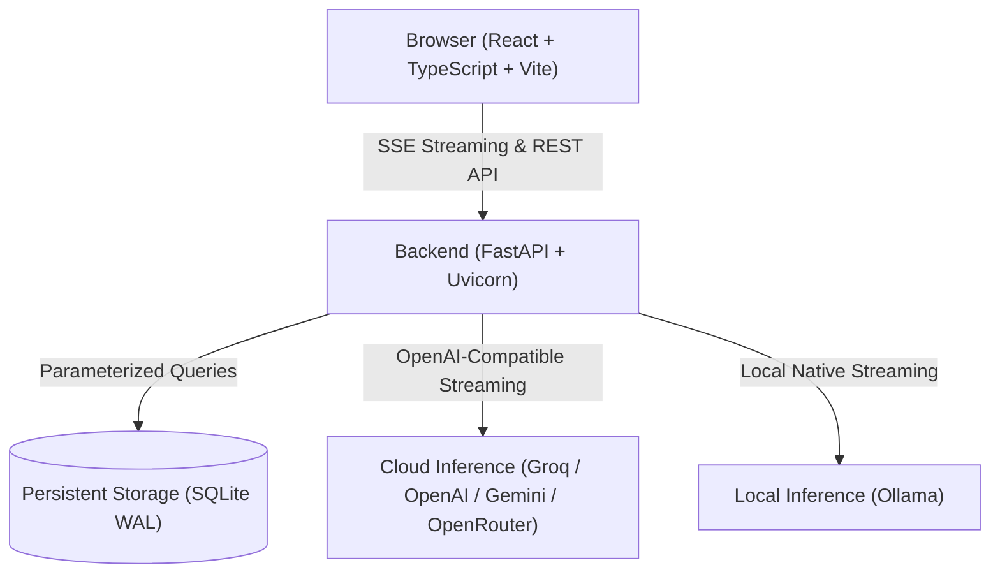

# Forma — Universal AI Workspace

[](https://github.com/Tishal68/Forma-chatbot/actions/workflows/ci.yml)
[](LICENSE)
[](https://fastapi.tiangolo.com)
[](https://react.dev)
[](README.md)

A private, lightning-fast conversational AI workspace built with **React**, **TypeScript**, **FastAPI**, **SQLite**, supporting both **cloud frontier models** (Groq, OpenAI, Google Gemini, OpenRouter) and **100% offline local inference** (Ollama).

Experience instant token streaming (300+ tokens/sec on Groq), frontier reasoning, persistent context memory, and complete privacy control.

---

## ✨ Features

- **⚡ Blazing Fast Streaming**: Stream responses at up to 500+ tokens/sec using Groq LPU inference, or stream locally via Ollama.
- **🧠 Multi-Model & Multi-Provider**:
  - **Groq**: Llama 3.3 70B, DeepSeek R1 Distill 70B, Llama 3.1 8B (ultra-fast & free tier).
  - **OpenAI**: GPT-4o, GPT-4o-mini, o3-mini.
  - **Google Gemini**: Gemini 2.0 Flash, Gemini 1.5 Pro.
  - **OpenRouter**: Claude 3.5 Sonnet, DeepSeek R1, Llama 3.3 70B.
  - **Ollama**: Local offline models (`llama3.2`, `deepseek-r1`, `qwen2.5`, `mistral`).
- **🔒 Secure Server-Side Key Management**: API keys remain strictly secure on the backend (via `.env` or deployment secrets) and are never exposed to browser clients or leaked in error logs.
- **🧠 Bounded Context Memory**: Rolling conversation summaries retain critical facts, requirements, and decisions while keeping prompt size optimal.
- **💬 Conversation Management**: Search conversations by title or message content, rename chats, edit earlier prompts, or regenerate replies.
- **🛡️ Production-Hardened Security**: Built-in HTTP Strict Transport Security (HSTS), Content Security Policy (CSP), timing-safe authentication, and origin isolation.
- **🎨 Modern Responsive UI**: Dedicated provider and model selectors, theme switching (Light / Dark / System), mobile drawer, keyboard navigation (`Ctrl + K`), and native modal dialogs.

---

## 🏗️ Architecture



---

## 🔒 Security & Encryption in Production

When hosted remotely (e.g., Render, Railway, or behind Caddy/Nginx), Forma enforces enterprise-grade security defaults:

- **HTTPS & Transport Encryption**: Strict HSTS header (`Strict-Transport-Security: max-age=31536000; includeSubDomains; preload`) ensures browsers communicate solely over encrypted TLS channels. Automatic HTTPS redirect when proxied.
- **Content Security Policy (CSP)**: Restricts scripts, objects, and connect sources to prevent Cross-Site Scripting (XSS) and packet injection.
- **Frame & Sniffing Protection**: `X-Frame-Options: DENY` prevents clickjacking; `X-Content-Type-Options: nosniff` disables MIME confusion.
- **Constant-Time Workspace Authentication**: Uses `secrets.compare_digest` to prevent timing attacks against HTTP Basic Auth credentials.
- **Origin Isolation**: Mutating endpoints (`POST`, `PATCH`, `DELETE`) reject unauthorized origins to block CSRF and cross-origin tampering.

---

## 🚀 Quick Start

### Prerequisites
- **Python 3.11+**
- **Node.js 20+** and npm
- *(Optional for local offline use)* **[Ollama](https://ollama.com/download)**

### 1. Clone & Set Up Backend

```bash
git clone https://github.com/Tishal68/Forma-chatbot.git
cd Forma-chatbot

# Set up Python virtual environment
python -m venv .venv
source .venv/bin/activate  # On Windows: .venv\Scripts\activate

# Install dependencies
pip install -r backend/requirements.txt

# Initialize environment configuration
cp .env.example .env       # On Windows: Copy-Item .env.example .env
```

### 2. Set Up Frontend

```bash
cd frontend
npm install
npm run dev
```

Open **http://127.0.0.1:5173** in your browser. Vite proxies `/api` calls directly to FastAPI on port 8000.

### 3. Run Backend Server

In a second terminal:

```bash
# From repository root:
uvicorn app.main:app --app-dir backend --host 127.0.0.1 --port 8000
```

> **Windows One-Click Launch**: A convenience script is included at [`scripts/launch.cmd`](scripts/launch.cmd). Running it starts both the backend service and opens your browser.

---

## 🤖 Supported Models & Providers

| Provider | Recommended Models | Speed | API Key Setup |
| :--- | :--- | :--- | :--- |
| **Groq** *(Recommended)* | `llama-3.3-70b-versatile`, `deepseek-r1-distill-llama-70b` | ⚡ 300+ tok/s | [Free Groq Key](https://console.groq.com/keys) |
| **OpenAI** | `gpt-4o-mini`, `gpt-4o`, `o3-mini` | ⚡ Fast | [OpenAI Platform](https://platform.openai.com/api-keys) |
| **Google Gemini** | `gemini-2.0-flash`, `gemini-1.5-pro` | ⚡ Blazing | [Google AI Studio](https://aistudio.google.com/app/apikey) |
| **OpenRouter** | `anthropic/claude-3.5-sonnet`, `deepseek/deepseek-r1` | ⚡ Fast | [OpenRouter Keys](https://openrouter.ai/keys) |
| **Ollama** | `llama3.2`, `mistral`, `qwen2.5-coder` | Depends on hardware | No key required (local) |

Set your desired provider API keys (`GROQ_API_KEY`, `OPENROUTER_API_KEY`, `GEMINI_API_KEY`, or `OPENAI_API_KEY`) in your server's `.env` file or cloud hosting environment settings. Forma's `/api/models` endpoint probes your configured providers and presents only operational models in the UI. Ollama is completely optional.

---

## ⚙️ Configuration

Settings are configured via `.env` in the project root:

| Variable | Default | Description |
| :--- | :--- | :--- |
| `GROQ_API_KEY` | *(empty)* | Optional API key for ultra-fast Groq inference. |
| `OPENAI_API_KEY` | *(empty)* | Optional API key for OpenAI GPT models. |
| `GEMINI_API_KEY` | *(empty)* | Optional API key for Google Gemini models. |
| `OPENROUTER_API_KEY` | *(empty)* | Optional API key for OpenRouter (Claude, DeepSeek, etc.). |
| `OLLAMA_BASE_URL` | `http://localhost:11434` | Address of reachable Ollama instance. |
| `OLLAMA_MODEL` | `llama3.2` | Default local LLM model identifier. |
| `DATABASE_PATH` | `data/chat.db` | Location of SQLite database file. |
| `CONTEXT_TOKENS` | `8192` | Model context window limit in tokens. |
| `OUTPUT_TOKENS` | `4096` | Maximum token limit for generated output. |

---

## 🧪 Testing

Run backend tests:
```bash
pytest
```

Verify frontend build:
```bash
cd frontend
npm run build
```

---

## 🚢 Deployment

For complete hosting guides on **Render** or **Railway** with persistent volumes and SSL encryption, see [DEPLOYMENT.md](DEPLOYMENT.md).

---

## 📄 License

This project is licensed under the [MIT License](LICENSE).

### Task-specific model choices

The model menu's **Choose by task** filter shows up to three currently eligible models for chat/writing, coding, reasoning, documents, web-supported answers, or image understanding. The backend returns these lists in `/api/models` as `feature_coverage`. Auto uses the same shortlist, with at most two backups before any response text is emitted. Manual selections never fail over automatically.

Shortlists prefer different providers where possible. A feature with only one option is marked limited; no verified options means unavailable. A successful model-list request is not a guarantee of inference quota or future uptime. Provider errors are still handled at generation time.

Ollama capabilities come from `/api/tags` or `/api/show`. OpenRouter input/output modalities and reasoning parameters come from its live model metadata. Cloud models without detailed capability discovery use the curated backend catalog intersected with the provider's current model list. See [Ollama model details](https://docs.ollama.com/api-reference/show-model-details) and [OpenRouter model metadata](https://openrouter.ai/docs/api/api-reference/models/list-all-models-and-their-properties).

Documents use this app's text extraction, and web answers use this app's search pipeline. These are not claims of native PDF or web-browsing support. Image creation uses dedicated Ollama/OpenRouter adapters; vision-only models are never presented as image generators.


### Creating images

1. Open the model menu and choose **Image generation** under **Choose by task** to see models your connected services report.
2. Select an image model, or select Auto and turn on **Create image** in the composer.
3. Describe the desired image and send. Auto also recognizes explicit requests such as "Generate an image of a forest"; manually selected chat models are never overridden. Ollama progress is shown when the server supplies diffusion-step counts. OpenRouter requests show a generation indicator until the image is ready.
4. Open or download the result from its image card. Images persist with the conversation in `ATTACHMENTS_DIR`; production needs a persistent volume. Stop cancels the upstream request, although cloud work already started may still incur charges.

**Ollama:** the experimental `/api/generate` image protocol is supported (`image`, `completed`, `total`, `done`). Discovery recognizes Ollama's actual `image` capability, not the model name. Z-Image Turbo and FLUX.2 Klein are examples, but installing a model does not guarantee the server can run it. Ollama's [experimental announcement](https://ollama.com/blog/image-generation) documents macOS support; current upstream revisions can reject image generation. Connect `OLLAMA_BASE_URL` to a server/version that actually supports it. Do not point a hosted app at your laptop's localhost. Normal local Ollama needs no API key.

**OpenRouter:** keep `OPENROUTER_API_KEY` on the backend. Forma discovers image models via `/images/models` and generates via `/images`, following the [dedicated image API](https://openrouter.ai/docs/guides/overview/multimodal/image-generation). Account credits, model access, and charges apply. A model being listed is not an inference-quota guarantee.

Version 1 supports text-to-image raster output (PNG, JPEG, WebP), preview, download, stop, and regeneration of the original prompt. Image editing/reference uploads, SVG output, and video generation are not implemented. Turn off web search and remove attachments before creating an image. Image requests are not automatically retried after upstream failures, to avoid duplicate billed work. Manual model choices remain pinned.

Generated output is size-bounded, decoded and validated as raster imagery, and served only to the owning visitor session. Generated files never become pending user uploads after regeneration. Uploaded documents remain download-only.

### Focused verification

```bash
python -m pytest -q
cd frontend
npm ci
npx playwright install chromium
npm run test:ui
npm run build
```

`test:ui` starts its own Vite server and mocks provider responses. Backend adapter tests also use controlled image fixtures. These tests verify integration behavior, not image quality or current paid-account access. Test a live image request after deploying with an available image provider.
